

# Hola, soy Miguel Romaña Villa

### Frontend Developer con enfoque Full Stack

Desarrollo interfaces web modernas con React, Next.js y TypeScript, integrando APIs, autenticación y flujos de usuario funcionales. También tengo bases de backend con Node.js y PostgreSQL, y estoy fortaleciendo esa área para construir aplicaciones cada vez más completas.

---

## Sobre mí

Soy desarrollador Full Stack con foco en frontend, especializado en crear aplicaciones web funcionales, escalables y orientadas a resolver problemas reales. Tengo formación en gestión y sistemas, lo que me ayuda a entender tanto la parte técnica como las necesidades operativas de una empresa.

Actualmente trabajo con React, Next.js, TypeScript, Node.js y PostgreSQL, desarrollando proyectos que incluyen autenticación, paneles por rol, integración de APIs, manejo de datos y flujos completos de usuario.

---

## Stack tecnológico

### Frontend

### Backend y base de datos

### Herramientas

---

## Proyectos destacados

### Psicólogo - Freddy Flores Quispe

Sitio web informativo para el psicoterapeuta Freddy Flores Quispe, creado para presentar sus servicios y facilitar el contacto con potenciales pacientes. El proyecto se encuentra en su fase final de desarrollo y propone una experiencia cercana, clara y adaptable a distintos dispositivos.

**Rol:** Frontend Developer y diseño de interfaz 
**Tecnologías:** React, Next.js, TypeScript, Lottie, Vercel 
**Estado:** fase final de desarrollo 
**Aspectos destacados:** primer proyecto en el que implementé un sistema de diseño propio para mantener la coherencia visual en colores, tipografía, componentes y patrones de interacción. Incluye presentación profesional, información sobre terapia online, servicios, contacto mediante WhatsApp, animaciones y diseño responsive

<a href="./galeria/freddy-flores/fred-home.png">
  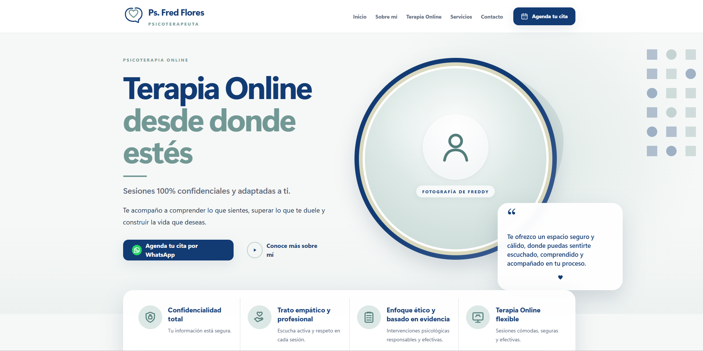
</a>

Ver galería de Psicólogo - Freddy Flores Quispe

 

| Inicio | Terapia online | Contacto |
|--------|----------------|----------|
|  | <a href="./galeria/freddy-flores/fred-terapia.png">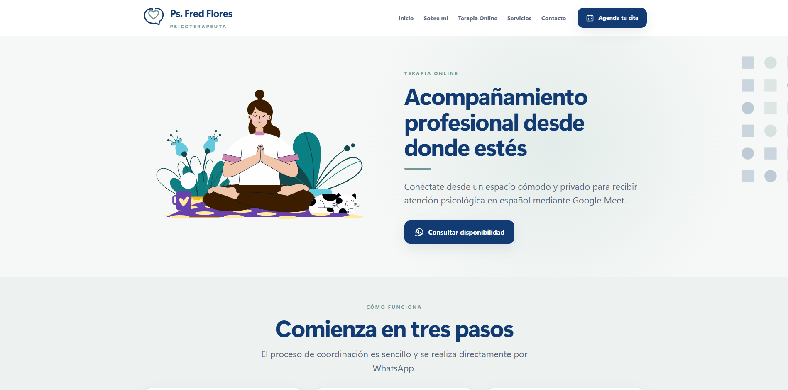</a> | <a href="./galeria/freddy-flores/fred-contacto.png">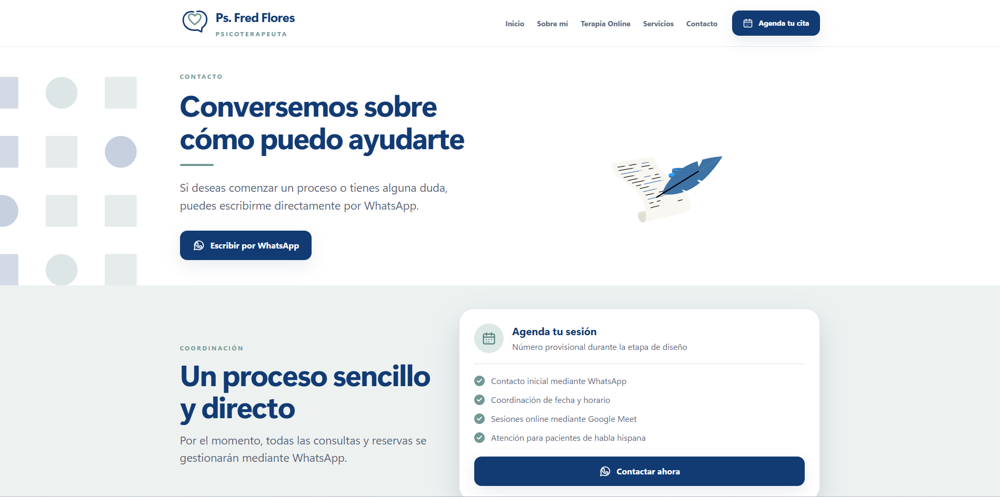</a> |

**Repositorio:** privado 
**Demo:** https://app-fredy-flores-quispe-front.vercel.app/ (versión en fase final)

---

### Estudio Contable Fidencia Villa

Sitio web corporativo desarrollado para el Estudio Contable Fidencia Villa. En su primera fase, el proyecto se enfocó en construir una experiencia visual moderna, clara y adaptable a distintos dispositivos, presentando los servicios, clientes e información de contacto del estudio.

**Rol:** Frontend Developer, en colaboración con un desarrollador senior encargado del backend y del sistema de administración contable 
**Tecnologías:** React, Next.js, TypeScript, Vercel 
**Funcionalidades:** presentación de servicios, sección institucional, cartera de clientes, formulario de contacto y diseño responsive. Próximamente se integrará con la API del sistema contable

<a href="./galeria/estudio-fidenciavilla/fv-home1.png">
  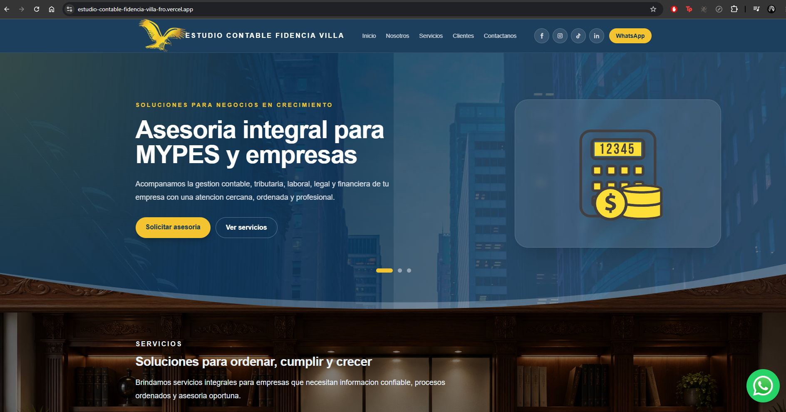
</a>

Ver galería de Estudio Contable Fidencia Villa

 

| Home | Servicios | Nosotros |
|------|-----------|----------|
|  | <a href="./galeria/estudio-fidenciavilla/fv-servicios.png">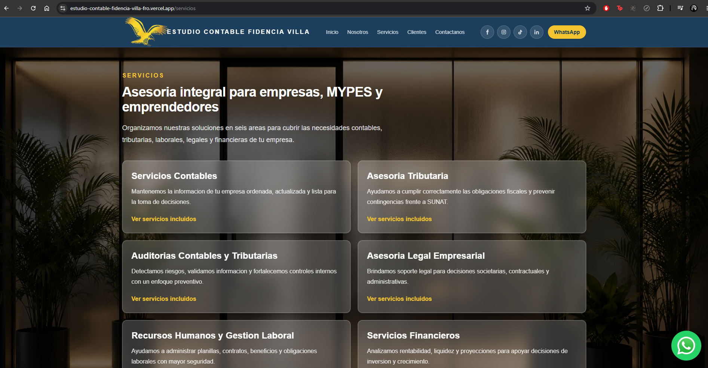</a> | <a href="./galeria/estudio-fidenciavilla/fv-nosotros.png">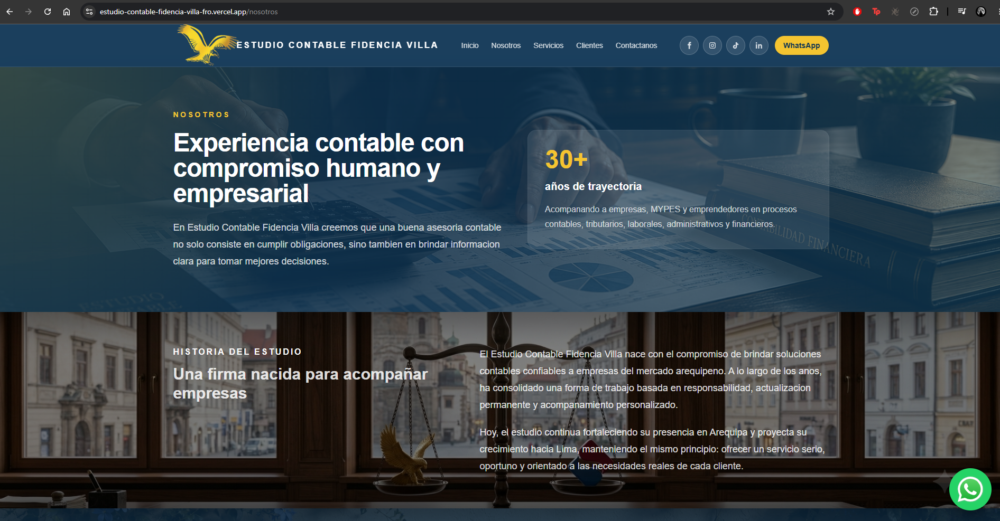</a> |

| Clientes | Contáctanos |
|----------|-------------|
| <a href="./galeria/estudio-fidenciavilla/fv-clientes.png">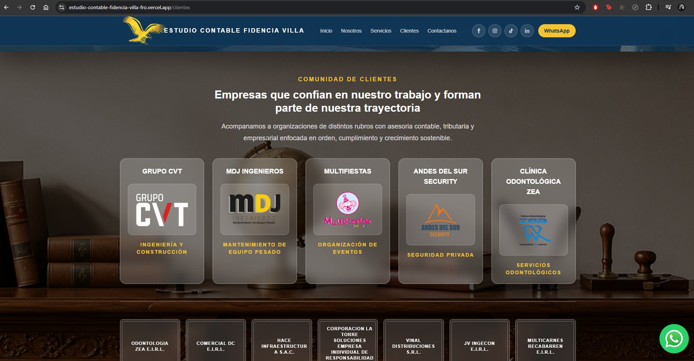</a> | <a href="./galeria/estudio-fidenciavilla/fv-contactanos.png">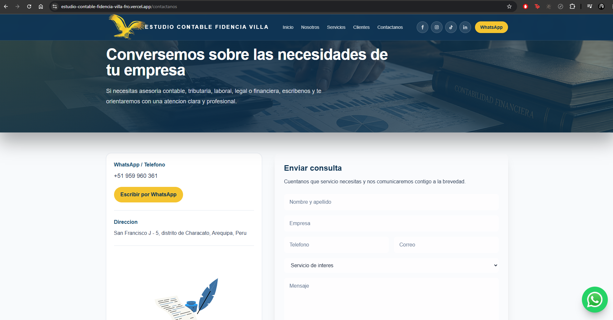</a> |

**Repositorio:** privado 
**Demo:** https://estudio-contable-fidencia-villa-fro.vercel.app/

---

### Staffy

Aplicación web de recursos humanos orientada a pequeños negocios y MYPES. Centraliza tareas básicas de gestión de personal como el control de asistencias, el registro de empleados, el cálculo de remuneraciones y la generación de documentos y reportes.

**Rol:** Full Stack Developer en un equipo de tres integrantes 
**Tecnologías:** React, Next.js, Tailwind CSS, Python, FastAPI, Supabase, Vercel 
**Funcionalidades:** control de asistencias, registro de empleados, cálculo de sueldos, gestión de bonos y descuentos, emisión de boletas y generación de reportes en PDF

<a href="./galeria/staffy/staffy-asistencias.png">
  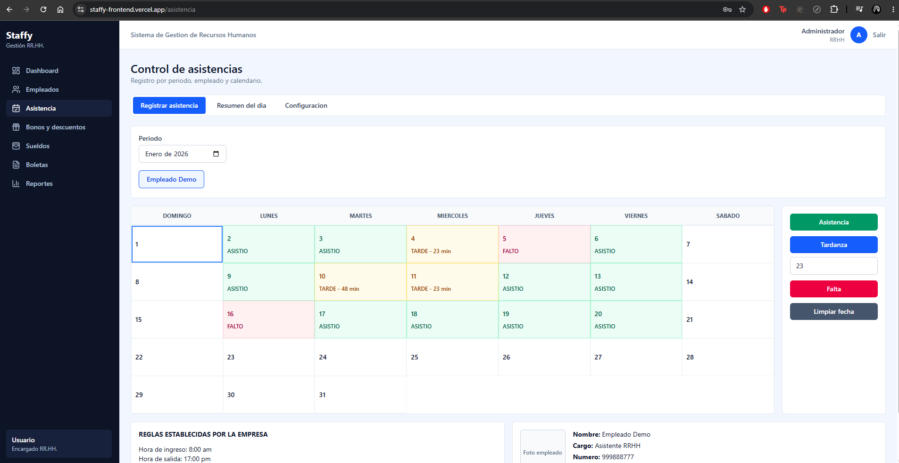
</a>

Ver galería de Staffy

 

| Asistencias | Dashboard | Empleados | Boletas |
|-------------|-----------|-----------|---------|
|  | <a href="./galeria/staffy/staffy-dashboard.png">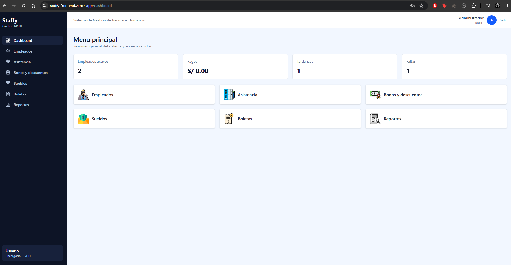</a> | <a href="./galeria/staffy/staffy-empleados.png">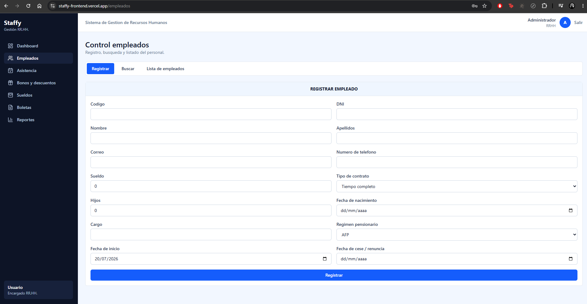</a> | <a href="./galeria/staffy/staffy-boletas.png">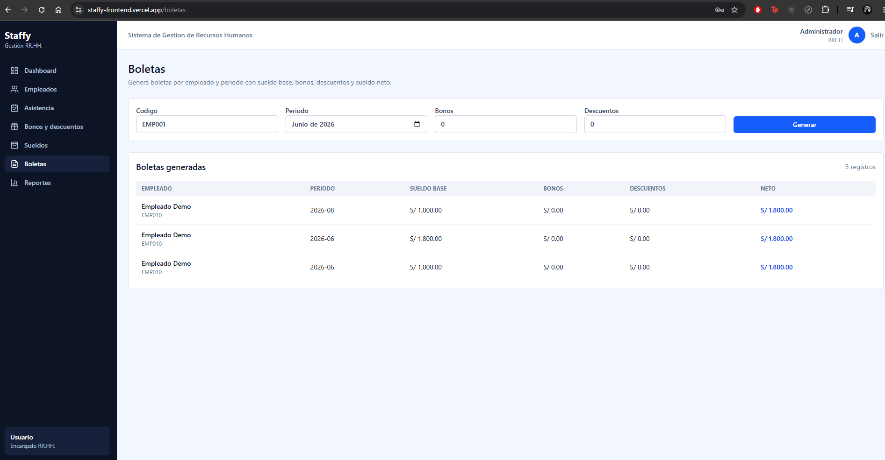</a> |

| Bonos y descuentos | Reportes | Inicio de sesión |
|--------------------|----------|------------------|
|  | <a href="./galeria/staffy/staffy-reportes.png">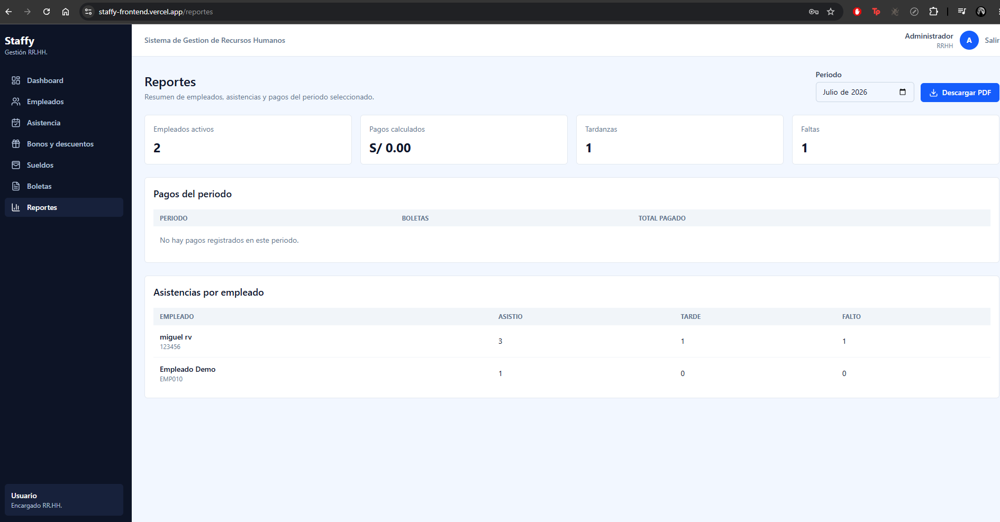</a> | <a href="./galeria/staffy/staffy-login.png">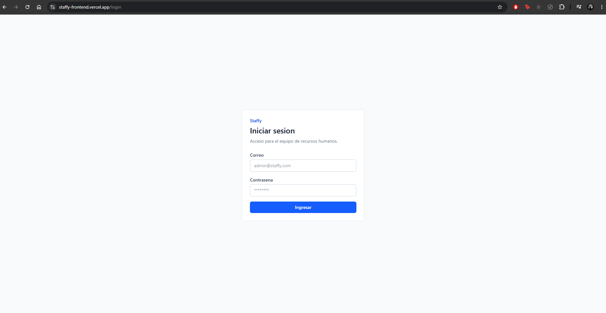</a> |

**Repositorios:** frontend y backend separados 
**Demo:** https://staffy-frontend.vercel.app/

---

### Trackifly

Plataforma web para gestión de pedidos y seguimiento logístico con múltiples roles de usuario. Permite crear pedidos, consultar envíos, trabajar con paneles por rol e integrar herramientas como mapas, pagos y asistencia para usuarios.

**Rol:** Frontend Developer principal, con participación en integración full stack 
**Tecnologías:** React, Next.js, TypeScript, Tailwind CSS, Node.js, NestJS, PostgreSQL, JWT 
**Funcionalidades:** autenticación, dashboard por roles, tracking de pedidos, gestión de empresas, reportes, mapas e integración de APIs

<a href="./galeria/trackifly/home.png">
  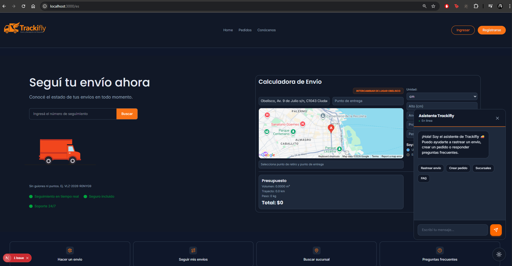
</a>

Ver galería de Trackifly

 

| Home | Panel empresa | Pedidos | Reportes |
|------|---------------|---------|----------|
|  | <a href="./galeria/trackifly/company.png">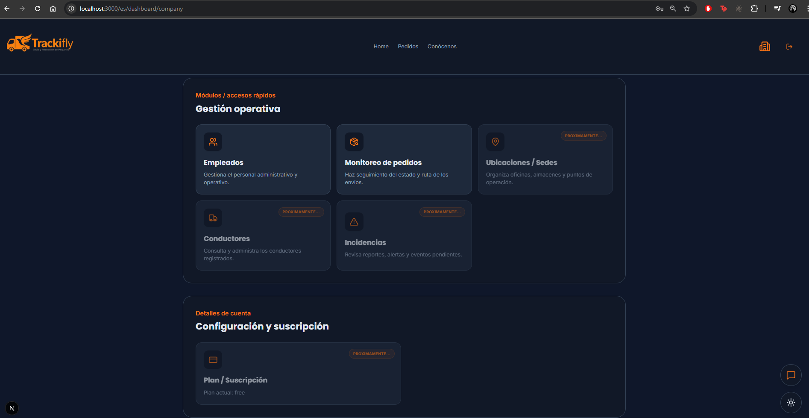</a> | <a href="./galeria/trackifly/pedidos.png">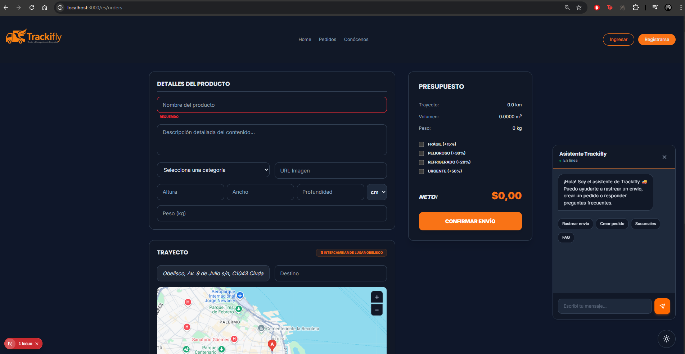</a> | <a href="./galeria/trackifly/reportes.png">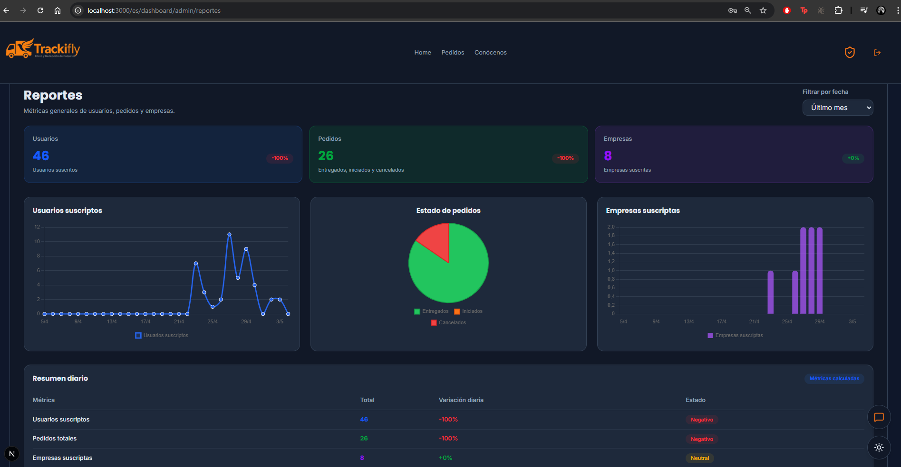</a> |

**Repositorio:** próximamente 
**Demo:** https://presentacion-trackifly.vercel.app/es

---

### VoltShop

E-commerce desarrollado con Next.js, React y TypeScript. Incluye autenticación con JWT, catálogo de productos, carrito de compras, detalle de producto, flujo de compra y panel de administración.

**Rol:** Full Stack Developer 
**Tecnologías:** Next.js, React, TypeScript, Tailwind CSS, Node.js, JWT 
**Funcionalidades:** login, registro, catálogo, carrito, detalle de producto, compra y dashboard administrativo

<a href="./galeria/voltshop/home.png">
  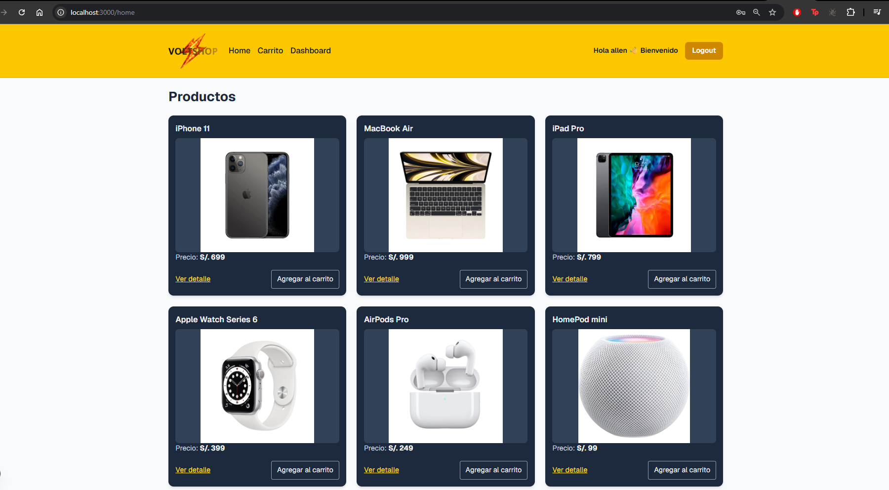
</a>

Ver galería de VoltShop

 

| Home | Producto | Carrito | Panel |
|------|----------|---------|-------|
|  | <a href="./galeria/voltshop/producto.png">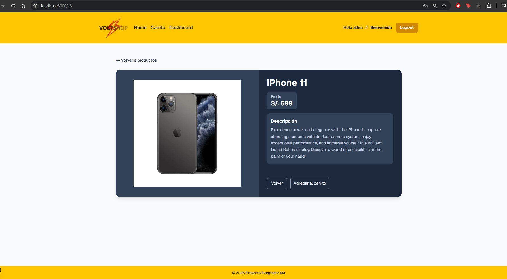</a> | <a href="./galeria/voltshop/carrito.png">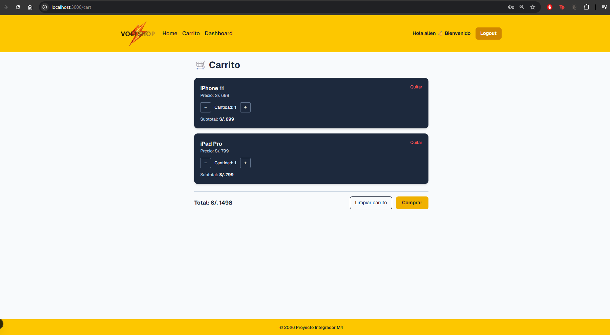</a> | <a href="./galeria/voltshop/panel.png">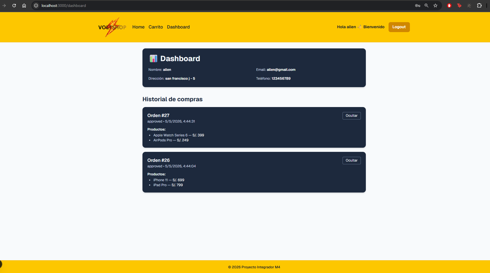</a> |

**Repositorio:** https://github.com/pi-rym/PM4FE-Miguel-A-Romana-Villa 

---

## Educación

- Universidad Peruana de Ciencias Aplicadas (UPC) - Desde 2024 - Actualidad, modalidad EPE (personas que trabajan)  
- Soy Henry - Bootcamp Full Stack Web Developer (2026)
- Google - Soporte de TI: Fundamentos (2025)
- CERTUS - Especialización en Recursos Humanos (2024)

---

## Contacto

- Email: [miguelromanavilla@gmail.com](mailto:miguelromanavilla@gmail.com)
- LinkedIn: [linkedin.com/in/miguel-rv](https://www.linkedin.com/in/miguel-rv/)
- Ubicación: Arequipa, Perú

---

Gracias por visitar mi perfil.

